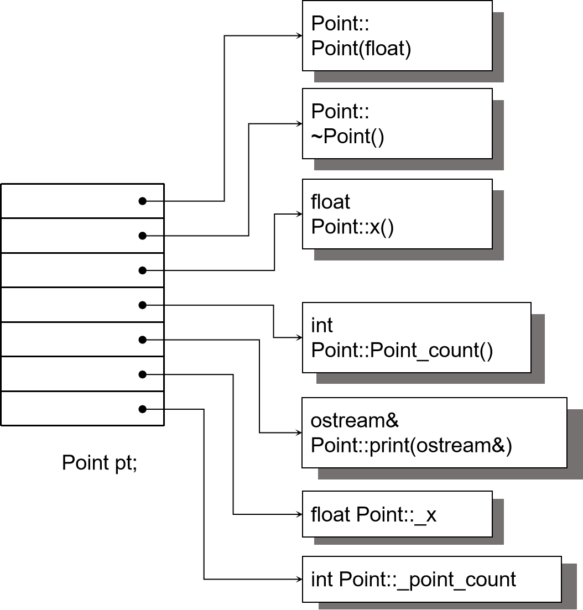
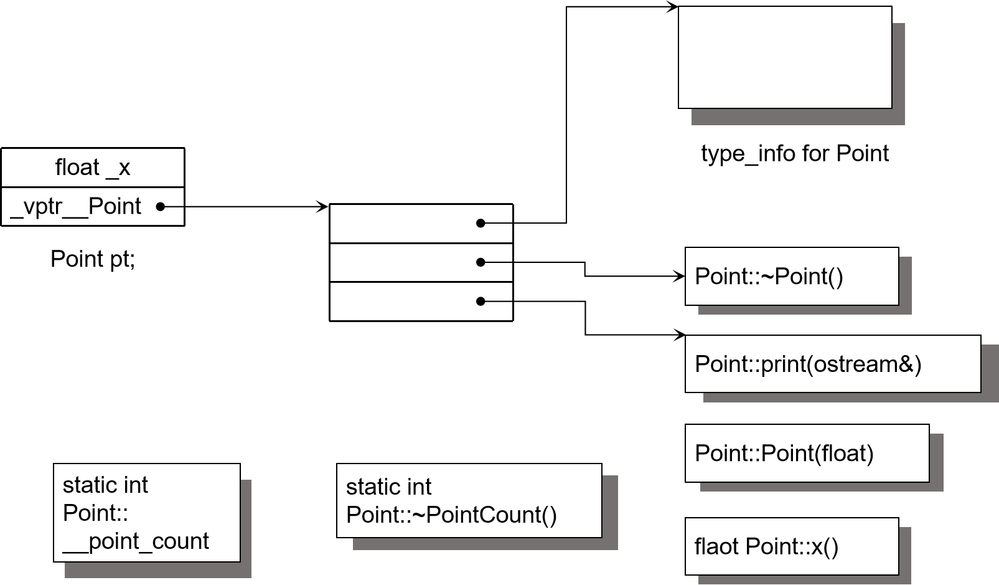
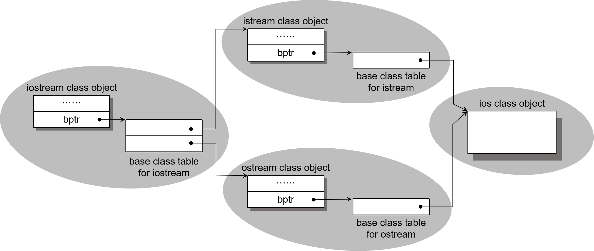
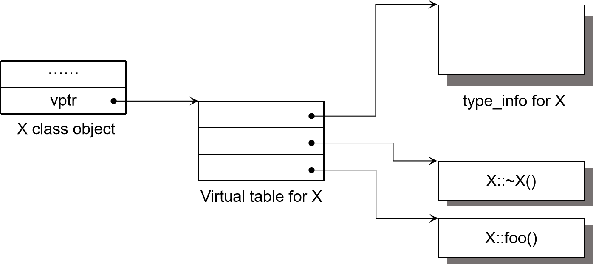
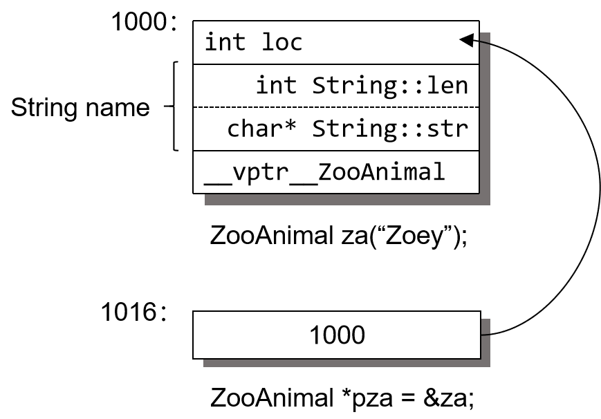
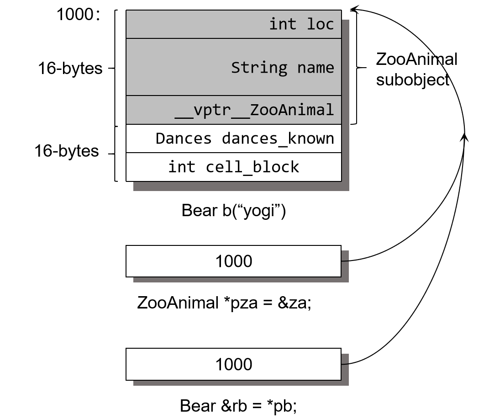
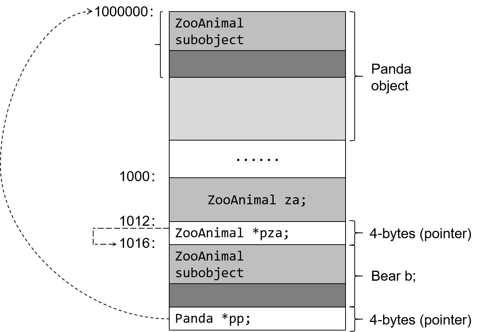

# 第一章 关于对象（Object Lessons）

在 C 语言中，“数据”和“处理数据的操作（函数）”是分开来声明的，也就是说，语言本身并没有支持“数据和函数”之间的关联性。我们把这种程序方法称为程序性的（procedural），由一组“分布子啊各个以功能为导向的函数中”的算法所驱动，它们处理的是共同的外部数据。举个例子，如果我们声明一个`struct Point3d`，向这样：
```c
typedef struct point3d
{
    float x;
    float y;
    float z;
} Point3d;
```
欲打印一个`Point3d`，可能就得定义一个像这样的函数：
```c
void
Point3d_print(const Point3d *pd)
{
    printf("(%g, %g, %g)", pd->, pd->y, pd-z);
}
```
或者，如果要更有效率一点，就定义一个宏：
```c
#define Point3d_print( pd ) \
    printf("(%g, %g, %g)", pd->x, pd->y, pd->z);
```
也可直接在程序中完成操作：
```c
void 
my_foo()
{
    Point3d *pd = get_a_point();
    ...
    /* 直接打印出 point ... */
    printf("(%g, %g, %g)", pd->x, pd->y, pd->z);
}
```
也可以经由一个前置处理宏来完成：
```c
#define X(p, xval)  (p.x) = (xval);
...
X(pt, 0.0);
```
在 C++ 中，`Point3d`有可能用独立的“抽象数据类型（abstract data type，ADT）”来实现：
```cpp
class Point3d
{
public:
    Point3d(float x = 0.0, float y = 0.0, float z = 0.0)
        : _x(x), _y(y), _z(z) {}
    
    float x() {return _x;}
    float y() {return _y;}
    float z() {return _z;}
    void x(float xval) { _x = xval; }

    // ...etc...
private:
    float _x;
    float _y;
    float _z;
};
inline ostream&
operator<<(ostream &os, const Point3d &pt)
{
    os << "(" << pt.x() << ", "
       << pt.y() << ", " << pt.z() << " )";
}
```
或是以一个双层或三层的 class 体系完成：
```cpp
class Point{
public:
    Point(float x = 0.0) : _x(x) {}

    flaot x() { return _x; }
    void x(float xval) { _x = xval; }
    //...
protected:
    float _x;
};
class Point2d : public Point{
public:
    Point2d(float x = 0.0, float y = 0.0)
        : Point(x), _y(y) {}

    float y() { return _y; }
    void y(float yval) ( _y = yval; })
    //...
protected:
    float _y;
};
class Point3d : public Point3d{
public:
    Point3d(float x = 0.0, float y = 0.0, float z = 0.0)
        : Point2d(x, y), _z(z) {}
    float z() { return _z; }
    void z(float zval) { _z = zval; }
    //...
protected:
    float _z;
};
```
更进一步来说，不管哪一种形式，它们都可以被参数化，可以是坐标类型的参数化：
```cpp
template<class type>
class Point3d
{
public:
    Point3d(type x = 0.0, type y = 0.0, type z = 0.0)
        : _x(x), _y(y), _z(z) {}
    type x() { return _x; }
    void x(type xval) { _x = xval; }

    // ...etc...
private:
    type _x;
    type _y;
    type _z;
}
```
也可以是坐标类型和坐标数目两者都参数化：
```cpp
template<class type, int dum>
class Point
{
public:
    Point();
    Point(type coords[dim]){
        for(int index = 0; index < dim; index++)
            __coords[index] = coords[index];
    }
    type& operator[](int index){
        assert(index < dim && index >= 0);
        return _coordins[index];
    }
    type operator[](int index) const
    { /* same as non-const instance */ }
    // ...etc...
private:
    type _coords[dim];
};
inline
template<class type, int dim>
ostream&
operator<<(ostream &os, const Point<type, dim> &pt)
{
    os << "(";
    for(int ix = 0; ix < dim - 1; ix ++)
        os << pt[ix] << ", ";
    os << pt[dim - 1];
    os << " )";
}
```

很明显，不只是程序风格上有截然的不同，在程序的思考上也有明显的差异。有许多令人信服的讨论告诉我们，从软件工程的眼光来看，为很么“一个 ADT 或 class hierarchy 的数据封装”比“在 C 程序中程序性地使用全局数据”好。但是这些讨论往往被那些“被要求快速让一个应用程序上马应战，并且执行起来又快又有效率”的程序员所忽略。毕竟 C 的吸引力就在于它的精瘦和容易（相对于 C++ 而言）。

在 C++ 中实现 3D 坐标点，比在 C 中复杂，尤其是在使用 template 的情况下。但这并不意味 C++ 就不更有威力，或是（唔，从软件工程的眼光来看）更好。当然啦，更有威力或更好，也不意味着使用上就更容易。

## 加上封装后的布局成本（Layout Costs for Adding Encapsulation）

程序员看到`Point3d`转换到 C++ 之后，第一个可能会问的问题就是：加上了封装之后，布局成本增加了多少？答案是 class Point3d 并没有增加成本。三个 data members 直接内含在每一个 class object 之中，就像 C struct 的情况一样。而 member functions 虽然含在 class 的声明之内，却不出现在 object 之中。每一个 non-inline member function 只会诞生一个函数实体。至于每一个“拥有零个或一个定义”的 inline function 则会在其每一个使用者（模块）身上产生一个函数实体。 `Point3d`支持封装性质，这一带并未带给它任何空间或执行期的不良回应。你即将看到，C++ 在布局以及存取时间上主要的额外负担是由 virtual 引起，包括：

**Virtual function机制** 用以支持一个有效率的“执行期绑定”（runtime binding）
**virtual base class** 用以实现“多次出现在继承体系中的 base class，有一个单一而被共享的实体”。

此外，还有一些多重继承下的额外负担，发生在“一个 derived class 和其第二或后继之 base class 的转换”之间。然而，一般言之，并没有什么天生的理由说 C++ 程序一定比其 C 兄弟庞大或迟缓。

## 1.1 C++对象模型（The C++ Object Model）

在 C++ 中，有两种 class data members: static 和 nonstatic，以及三种 class member functions: static、nonstaitc 和 virtual。已知下面这个 class Point 声明：
```cpp
class Point{
public:
    Point(float xval);
    virtual ~Point();

    float x() const;
    static int PointCount();
protected:
    virtual ostream& print(ostream &os) const;
    float _x;
    static int _point_count;
};
```
这个 class Point 在机器中将会被怎么样表现呢？也就是说，我们如何模塑（modeling）出各种 data members 和 function members 呢？

### 简单对象模型（A Simple Object Model）

我们的第一个模型十分简单。它可能是为了尽量减低 C++ 编译器的设计复杂度而开发出来的，赔上的则是空间和执行器的效率。在这个简单模型中，一个 object 是一系列的slots，每一个 slot 指向一个 members。Members 按其声明次序，各被指定一个 slot。每一个 data member 或 function member 都有自己的一个 slot。图 1.1 可以说明这种模型。



图 1.1 简单对象模型（Simple Object Model)

在这个简单模型中，members 本身并不放在 object 之中，只有“指向 member 的指针”才放在 object 内。这么做可以避免“members 有不同的类型，因而需要不同的存储空间”所招致的问题。Object 中的 members 是以 slot 的索引值来寻址，本例之中`_x`的索引值是 6，`_point_count`的索引值是7。一个 class object 的大小很容易计算出来：“指针大小，乘以 class 中所声明的 members 数目”便是。

虽然这个模型并没有被应用于实际产品上，不过关于索引或 slot 数目的观念，倒是被应用到 C++ 的“指向成员的指针”（pointer-to-member）观念之中。

### 表格驱动对象模型（A Table-driven Object Model）

为了对所有 class 的所有 objects 都有一致表达方式，另一种对象模型是把所有与 members 相关的信息抽出来，放在一个 data member table 和一个 member function table 之中，class object 本身则内含指向这两个表格的指针。Member function table 是一系列的 slots，每一个 slot 指出一个 member function；Data member table 则直接含有data 本身，如图 1.2 所示。


图 1.2 Member Table 对象模型（Member Table Object Model）

虽然这个模型也没有实际应用于真正的C++编译器身上，但 member function table 这个观念却成为支持 virtual functions 的一个有效方案[1]。

[1] 至少有一个 CORBA ORB 实际产品使用了这种“双表格模型”。SOM 对象模型也依赖这种“双表格模型” [HAM95]

### C++对象模型（The C++ Object Model）

Stroustrup 当初设计（当前亦仍占有优势）的 C++ 对象模型是从简单对象模型派生而来的，并对内存空间和存取时间做了优化。在此模型中，Nonstatic data members 被配置于每一个 class object 之内，static data members 则被存放在所有的class object之外。Static 和 nonstatic function members 也被放在所有的 class object 之外，virtual functions 则以两个步骤支持之：

1. 每一个class产生出一堆指向 virtual functions 的指针，放在表格之中。这个表格被称为 virtual table (**vtbl**)。
2. 每一个 class object 被添加了一个指针，指向相关的 virtual table。通常这个指针被称为 **vptr**。vptr 的设定（setting）和重置（resetting）都由每一个 class 的 constructor、destructor 和 copy assignment 运算符自动完成（我将在第 5 章讨论）。每一个 class 所关联的 type_info object（用以支持runtime idenrification, RTTI）也经由 virtual table 被指出来，通常是放在表格的第一个 slot 处。



图 1.3 C++对象模型（C++ Object Model）

图1.3说明C++对象模型如何应用于前面所说的`Point class`身上。这个模型的主要优点在于它的空间和存取时间效率；主要缺点则是，如果应用程序代码本身未曾改变，但所用到的class object的nonstatic data members有所修改（可能是增加、移除或更改），那么那些应用程序代码同样得重新编译。关于这点，前述的双表格模型就提供了较大的弹性，因为它多提供了一层间接性，不过它也因为付出空间和执行效率两方面的代价就是了。

### 加上继承（Adding Inheritance）

C++ 支持单一继承：
```cpp
class Library_materials { ... };
class Book : public Library_materials { ... };
class Rental_book : public Book { ... };
```
C++ 也支持多重继承：
```cpp
// 原本的（更早于标准版的）iostream实现方式
class iostream : public istream, public ostream{
    ...
};
```
甚至，继承关系也可以指定为虚拟（virtual，也就是共享的意思）：
```cpp
class istream : virtual public ios { ... };
class ostream : virtual public ios { ... };
```
在虚拟继承的情况下，base class 不管在继承串链中被派生（derived）多少次，永远只会存在一个实体（称为 subobject）。例如 iostream 之中就只有 virtual ios base class 的一个实体。

一个 derived class 如何在本质上模塑其 base class 的实体呢？在“简单对象模型”中，每一个 base class 可以被 derived class object 内的一个 slot 指出，该 slot 内含 base class subobject 的地址。这个体制的主要缺点是，因为间接性而导致空间和存取时间上的额外负担，优点则是 class object 的大小不会因其 base classes 的改变而受到影响。

当然啦，你也可以想象另一种所谓的 base table 模型。这里所说的 base class table 被产生出来时，表格中的每一个 slot 内含一个相关的 base class 地址，这很像 virtual table 内含每一个 virtual function 的地址一样。每一个 class object 内含一个 bptr，它会被初始化，指向其 base class table。这种策略的主要缺点是由于间接性而导致的空间和存取时间上的额外负担，优点则是在每一个 class object 中对于继承都有一致的表现：每一个 class object 都应该在某个固定位置上安放一个 base table 指针，与 base class 的大小或数目无关。第二个优点是，不需要改变 class objects 本身，就可以放大、缩小、或更改 base class table.

译注：我以下图表现 base class table 模型在虚拟多重继承中的应用（以稍早的 iostream 为例）：


不管上述哪一种体制，“间接性”的级数都将因为继承的深度而增加。例如，一个 Rental_book 需要两次间接存取才能够探取到继承自 Library_materials 的 members，而 Book 只需要一次。如果在 derived class 内复制一个指针，指向继承串链中的每一个 base class，倒是可以获得一个永远不变的存取时间。当然这必须付出代价，因为需要额外的空间来放置额外的指针。

C++ 最初采用的继承模型并不运用任何间接性：base class subobject 的 data members 被直接放置于 derived class object 中。这提供了对 base class members 最紧凑而且最有效率的存取。缺点呢？当然就是：base class members 的任何改变，包括增加、移除或改变类型等等，都使得所有用到“此 base class 或其 dereived class 之 objects”者必须重新编译。

自 C++ 2.0 起才新导入的 virtual base class，需要一些间接的 base class 表现方法。Virtual base class 的原始模型是在 class object 中为每一个有关联的virtual base class 加上一个指针。其它演化出来的模型则若不是导入一个 virtual base class table，就是扩充原已存在的 virtual table，以便维护每一个 virtual base class的位置。3.4 节有这方面的详细讨论。

## 对象模型如何影响程序（How the Object Model Effects Programs）

这对程序员带来什么意义呢？喔，不同的对象模型，会导致“现有的程序代码必须修改”以及“必须加入新的程序代码”两个结果。例如下面这个函数，其中 class X 定义了一个 copy constructor， 一个 virtual destructor，和一个 virtual function foo:
```cpp
X foobar()
{
    X xx;
    X *px = new X;

    // foo()是一个virtual function
    xx.foo();
    px->foo();

    delete px;
    return xx;
}

```
这个函数有可能在内部被转化为：
```c
// 可能的内部转换结果
// 虚拟C++码
void foobar(X &_result)
{
    // 构造 _result
    // _result用来取代local xx ...
    _result.X::X();

    // 扩展 X *px = new X;
    px = _new( sizeof(X) );
    if (px != 0)
        px->X::X();
    
    // 扩展xx.foo()但不使用virtual机制
    // 以 _result取代xx
    foo( &_result );

    // 使用virtual机制扩展px->foo()
    ( *px->vtbl[2] )( px )

    // 扩展delete px;
    if ( px != 0 ){
        ( *px->vtbl[1] ) ( px ); // destructor
        _delete( px );
    }

    // 不需使用named return statement
    // 不需要摧毁local object xx
    return;
};
```
喔，真是差异颇大，不是吗！当然，此刻你并不需要了解所有的转化过程及结果。我会在后续章节解释其中每一步操作的用意，以及为什么那么做。我想你会回头看，一边玩弄你的手指头，一边说“喔欧，使得，当然”，同时奇怪你怎么会曾经迷惘过。

译注：我可以先用这张图解除你的部分疑惑。由于 X 有两个 virtual functions，一个是 destructor，一个是 foo，所以 X object 布局如下：


前述程序代码中的`px->_vtbl[0]`指向 X 的 type_info object，`px->_vtbl[1]`指向`X::~X()`，`px->_vtbl[2]`指向`X::foo()`。

## 1.2 关键词所带来的差异（A Keyword Distinction）

如果不是为了努力维护与 C 之间的兼容性，C++ 远可以比现在更简单些。举个例子，如果没有八种整数需要支持的话，overloaded function 的解决方式将会简单得多。同样的道理，如果 C++ 丢掉 C 的声明语法，就不需要花脑筋去判断下面这一行其实是 pf 的一个函数调用（invocation）操作而不是其声明：
```c
// 不知道下面是个declaration还是invocation
// 直到看到整数常量1024才能决定
int ( *pf )( 1024 );
```
而在下面这个声明中，像上面那样的“向前预览（lookahead）”甚至起不了作用：
```c
// meta-language rule:
// pq的一个declaration，而不是invocation
int ( *pq )( );
```
当语言无法区分那是一个声明还是一个表达式时（expression）时，我们需要一个超越语言范围的规则，而该规则会将上述式子判断为一个“声明”。

同样地，如果 C++ 并不需要支持 C 原有的 struct，那么 class 的观念可以借由关键词**class**来支持。但绝对令你惊讶的是，从 C 迁移到 C++，除了效率，另一个最常被程序员询问的问题就是：什么时候一个人应该在 C++ 程序中以 struct 取代 class?

如果是 1986 年，我的答案毫不拖泥带水：“绝不”！在我的 C++ Primer 第一版和第二版中（译注：第三版已于 1998/05 出版），关键词 struct 并未出现在书籍正文，只出现在附录 C，而附录 C 用来讨论 C 语言。在那时候，这是一个人非万不得已不会指出的一些小小哲学问题中的一个。然而如果能够指出这个问题，你可以获得一些小小（一般公认非常小）的满足。通常问题会被这样指出：“嘿，你知道吗，struct 那个关键词，其实没什么用······”。但就像贝尔实验室（译注：Bell Lab，C++ 发源地）的一个同事婉转对我说的，即使是最小的哲学问题也有人需要解答。如果一个 C 程序员渴望学习 C++，当他发现我的书中没有提到 struct，一定会相当苦恼。很显然把这个主题含入，可以提供语言转移时的救生素，让程序员攀上高峰时少点折磨。呵，多么哲学啊！

### 关键词的困扰

那么，让我重新问一次：“什么时候一个人应该使用 struct 取代 class？答案之一是：当它让一个人感觉比较好的时候。

虽然这个答案并没有达到高技术水平，但他的确指出了一个重要的特性：关键词**struct**本身并不一定要象征其后随之声明的任何东西。我们可以使用 struct 代替 class，但仍然声明 public、protected、private 等等存取区段，以及一个完全 public 的借口，以及 virtual functions，以及单一继承、多重继承、虚拟继承等等。以前，似乎每个人都得在一小时的 C++ 简介中花费整整十分钟来看清楚以下两者的相同：
```cpp
class cplus_plus_keyword{
public::
    // mumble
};
```
和其 C 对等品：
```c
struct c_keyword{
    // the same mumble
};
```
当人们和教学书说到`struct`时，他们的意思是一个数据集合体，没有 private data，也没有 data 的相应操作（译注：指 member function），亦即纯然的 C 用法，这种用途应该和 C++ 的“使用者自定义类型”（user-defined type）用法区分开来。在 C 这一边，这个关键词的设计理由因其用法而存在；而在 C++ 那一边，选择 struct 或 class“作为关键词，并用以导入 ADT”的理由，是希望从此比较健全。这远比讨论“函数需不需要一个大括号”，或是“要不要在变量名称和类型名称中使用下划线（例如 IsRight 或 is_right）”更具有精神层次。

在 C 所支持的 struct 和 C++ 所支持的 class 之间，有一个观念上的重要差异。我的重点很简单：关键词本身并不提供这种差异。也就是说，如果一个人拥有下面的 C++ 使用者自定义类型，他可以说“喔，那是一个 class”：
```c
// struct名称（或class名称）暂时忽略
{
public:
    operator int()
    virtual void foo();
    //...
protected:
    static int object_count;
    // mumble
};
```
事实上你可以说上面那个东西是个 struct，也可以说它是个 class。这两种声明的观念上的意义取决于对“声明”本身的检验。

举个例子，在 cfront（译注：第一个 C++ 实作品，由 Lippman 完成）之中，上述两个关键词在语意分析器（parse）中是以共享的“AGGR”替换的。而在 Foundation 项目中，Rob Murray 的 ALF 层次结构保留了程序员真正使用的关键词。然而这份信息并未在更内层的编译器中被使用，倒是可以被一个“unparse”工具用来还原程序的 ASC11 面貌。啊，是的，如果程序经过“unparse”处理过后，无法还原原本使用的关键词，程序员一定会很沮丧——即使程序在其它方面是相等的。

我第一次被我所谓的“关键词受难记”绊倒，是在大约 1988 年，当时我们测试小组中的一位成员对 cfront 发出一个“大难临头，即将完蛋”的臭虫报告。在 cfront 内部的类型层次结构的原始声明中，根节点（root node）和每一个派生下来的子类型（subtype）是以 struct 关键词来声明的，而在陆陆续续的头文件（header files）中，某些派生子类型（derived subtypes）的前置声明（forward declaration）却是使用关键词 class:
```cpp
// 不合法吗？不，只不过是不一致罢了
class node;
...
struct node { ... };
```
我们的测试员说这是一个粗野的错误，是一个 cfront 无法捕捉的问题，因为···呃···当然······cfront用来编译它自己。

真正的问题并不在于所有“使用者自定义类型”的声明是否必须使用相同的关键词，问题在于使用 class 或 struct 关键词是否可以给与“类型的内部声明”以某种承诺。也就是说，如果 struct 关键词的使用实现了 C 的数据萃取观念，而 class 关键词实现的是 C++ 的 ADT（Abstract Data Type）观念，那么当然“不一致性”是一种错误的语言用法。就好像下面这种错误，一个 object 被矛盾地声明为 static 和 extern：
```cpp
// 不合法吗？是的
// 以下两种声明造成矛盾的存储空间
static int foo;
...
extern int foo;
```
这组声明对于 foo 的存储空间造成矛盾。然而，如你所见，struct 和 class 这两个关键词并不会造成这样的矛盾，class 的真正特性是由声明的本身（declaration body）来决定的。“一致性的用法”只不过是一种风格上的问题而已。

我第二次接触这个问题是在 C++ 3.0 所引入的“parameter lists template”上头。Steve Burof，我的另一位贝尔实验室同事，有一天走进我的办公室并指出以下程序代码被语意分析器视为不合法：
```cpp
// 最初始被标示为不合法的
template<struct Type>
struct mumble { ... };
```
然而下面的代码却是合法的：
```cpp
// 没问题：它明白使用了class关键词
template<class Type>
struct mumble { ... };
```
“为什么?”他问道。

“为什么不？”我清楚地予以回击，然后详细说明 templates 并不打算与 C 兼容。我说我们撇开 struct 不谈，然后再看看它做什么事。我想我大概一跃而过我的 Sun3/60 机器并以最佳姿态挥舞鼠标——老实说我不记得了。不过我记得最终我更改了语意分析器（parser），使它同时接受两个关键词--在没有实现通知 Bjarne 和少不更事的 ANSI C++ 委员会的情况下。这是这个语言用词的诞生由来。

你可能会争辩说，如果这个语言只支持一个关键词，可以省掉许多混淆与迷惑。但你要知道，如果 C++ 要支持现存的 C 程序代码，它就不能不支持 struct。好的，那么他需要引入新的关键词 class 吗？真的需要吗？不！但引入它的确非常令人满意，因为这个语言所引入的不只是关键词，还有它所支持的封装和继承的哲学。你不妨发挥一下想象力，想想当谈论到一个抽象的 base struct（例如 ZooAnimal struct 层次结构）时，其中内含一个或更多 virtual base struct 的情形。

在前面的讨论中，我区分了“struct 关键词的使用”和“一个 struct 声明的逻辑意义”。你也可以主张说这个关键词的使用伴随着一个 public 借口的声明，及好像在公开演讲中使用暗语或昵称一样。你甚至可以主张说它的用途只是为了方便 C 程序员迁徙至 C++ 部落。

###  策略性正确的struct（The Politically Correct Struct）

C 程序员的巧计有时候却成为 C++ 程序员的陷阱。例如把单一元素的数组放在一个 struct 的尾端，于是每个 struct objects 可以拥有可变大小的数组：
```c
struct mumble{
    /* stuff */
    char pc[1];
};
// 从档案或标准输入装置中取得一个字符串
// 然后为struct本身和该字符串配置足够的内存
struct mumble *pmumbl = ( struct mumble* )
    malloc( sizeof(struct mumble ) + strlen( string ) + 1);

strcpy( &memble.pc, string );
```
如果我们改用 class 来声明，而该 class 是：

1. 指定多个 access sections，内含数据；
2. 从另一个 class 派生而来；
3. 定义有一个或多个 virtual functions.

那么或许可以顺利转化，但也或许不行！

C++ 中凡处于同一个 access section 的数据，必定保证以其声明次序出现在内存布局当中，然而被放置在多个 access sectinos 中的各笔数据，排列次序就不一定了。下面的声明中，前述的 C 伎俩或许可以有效运行，或许不能，需视 protected data members 被放在 private data members 的前面或后面而定（译注：放在前面才可以）：
```cpp
class stumble{
public:
    // operations...
protected:
    // protected stuff
private:
    /* private stuff */
    char pc[1];
}
```
同样的道理，base classes 和 derived classes 的 data members 的布局也没有谁先谁后的强制规定，因而也就不保证前述的 C 伎俩一定有效。virtual functions 的存在也会使前述伎俩的有效性成为一个问号。所以最好的忠告就是：不要那么做（第 3 章会详细地讨论相关的内存布局主题）！

如果一个成员迫切需要一个相当复杂的 C++ class 的某部分数据，使他拥有 C 声明的那种样子，那么那一部分最好抽取出来成为一个独立的 struct 声明。将 C 与 C++ 组合在一起的作法就是，从 C struct 中派生 C++ 的部分：
```c
struct C_point { ... };
class Point : public C_point { ... };
```
于是 C 和 C++ 两种用法都可获得支持：
```cpp
extern void draw_line( Point, Point);
extern "C" void draw_rect( C_Point, C_point);

draw_line( Point(0, 0), Point(100, 100));
draw_rect( Point(0, 0), Point(100, 100));
```
这种习惯用法现已不再被推荐，因为某些编译器（如 Microsoft C++）在支持 virtual function 的机制中对于 class 的继承布局做了一些改变（请看 3.4）节的讨论）。组合（composition），而非继承，才是把 C 和 C++ 组合在一起的唯一可行方法（conversion 运算符提供了一个十分便利的萃取方法）：
```cpp
struc C_point {...};

class Point{
public:
    operator C_point() { return _c_point; }
    // ....
private:
    C_point _c_point;
    // ...
};
```
C struct 在 C++ 中的一个合理用途，是当你要传递“一个复杂的 class object 的全部或部分”到某个 C 函数中去时，struct 声明可以将数据封装起来，并保证拥有与 C 兼容的空间布局。然而这项保证只在组合（composition）的情况下才存在。如果是“继承”而不是“组合”，编译器会决定是否应该有额外的 data members 被安插到 base struct subobject 之中（再一次请你参考3.4节的讨论以及图3.2a和图3.2b）。

## 1.3 对象的差异（An Object Distinction）

C++程序设计模型直接支持三种 programming paradigms (程序设计典范)：

译注：paradigm 这个字眼常被译为典范。但典范又是什么意思呢？下面是牛津计算机词典对 paradigm 这个词条的解释：

> A model or example of the environment and methodology in which systems and software are developed and operated. For one operational paradigm there cound be serveal alternative development paradigms. Examples are functional programming, logic programming, semantic data modeling algebraic computing, numerical computing, object oriented design, prototyping, and natural language dialogue.

> 一种环境设计和方法论的模型或范例：系统和软件以此模型来开发和运行。一个现役的典范可能会有数个开发的替代典范。以下是一些大家比较熟悉的典范：函数式程序设计，逻辑程序设计，语意数据模型、几何计算、数值计算、面向对象设计、原型设计、自然语言。

1. 程序模型（procedural model），就像 C 一样，C++ 当然也支持它。字符串的处理就是一个例子，我们可以使用字符数组以及 str* 函数集（定义在标准的 C 函数库中）：
```c
char boy[] = "Danny";
char *p_son;
...
p_son = new char[ strlen(boy) + 1];
strcpy(p_son, boy);
...
if (!strcmp(p_son, boy))
    take_to_disneyland(boy);
```
2. 抽象数据类型模型（abstract data type model， ADT）。该模型所谓的“抽象”是和一组表达式（public 接口）一起提供，而其运算定义仍然隐而未明。例如下面的 string class:
```cpp
String girl = "Anna";
String daughter;
...
// String::operator=();
daughter = girl;
...
// String::operator==();
if (girl == daughter)
    take_to_disneyland(girl);
```
3. 面向对象模型（object-oriented model）。在此模型中有一些彼此相关的类型，通过一个抽象的 base class（用以提供共通接口）被封装起来。Library_materials class 就是一个例子，真正的 subtypes 例如 Book、Video、Compact_Disc、Puppet、Laptop 等等都可以从那里派生而来：
```cpp
void
check_in(Library_materials *pmat)
{
    if(pmat->late())
        pmat->fine();
    
    if(Lender *plend = pmat->reserved())
        pmat->notify(plend);
}
```
纯粹以一种 paradigm 写程序，有助于整体行为的良好稳固。然而如果混合了不同的 paradigms，就可能会带来让人惊吓的后果，特别是在没有谨慎处理的情况下，最常见的疏忽在当你以一个 base class 的具体实体如：
```cpp
Library_materials thing1;
```
来完成某种多态（Polymorphism）局面时：
```c
// class Book : public Library_materials{ ... }；
Book book;

// 喔欧：thing1不是一个Book!
// book被裁减（sliced）了
// 不过thing1仍保有一个Library_materials.
thing1 = book;

// 喔欧：调用的时Library_materails::check_in()
thing1.check_in();
```
而不是通过 base class 的 pointer 或 refernce 来完成多态局面：
```cpp
// OK: 现在thing2参考到book
Library_materials &thing2 = book;

// OK：现在引发的是Book::check_in()
thing2.check_in();
```
虽然你可以直接或间接处理继承体系中的一个 base class object，但只有通过 pointer 或 reference 的间接处理，才支持 OO 程序设计所需的多态性质。上个例子中的 thing2 的定义和运用，是 OO paradigm 中一个良好的例证。thing1 的定义和运用则逸出了 OO 的习惯：它反映的是一个 ADT paradigm 的良好行为。thing1 的行为是好是坏，视程序员的意图而定。在此范例中，它的行为非常有可能不是你要的。

在 OO paradigm 之中，程序员需要处理一个未知实体，它的类型虽然有所界定，却有无穷可能。这组类型受限于其继承体系，然而该体系理论上没有深度和广度的限制。原则上，被指定的 object 的真实类型在每一个特定执行点之前，是无法解析的。在 C++ 中，只有通过 pointers 和 references 的操作才能完成。相反地，在 ADT paradigm 中程序员处理的是一个拥有固定而单一类型的实体，它在编译时期就已经完全定义好了。举个例子，下面这组声明：
```cpp
// 描述objects：不确定类型
Librar_materials *px = retrieve_some_material();
Librar_materials &rx = *px;

// 描述已知物：不可能有令人惊讶的结果产生
Librar_materials dx = *px;
```
你绝对没有办法确定地说出 px 或 rx 到底指向何种类型的 objects，你只能够说它要不就是 Library_materials object，要不就是后者的一个子类型（subtype）。不过，我们倒可以确定，dx 只能是Library_materials class 的一个 object。本节稍后，我会讨论为什么这样的行为虽然或许未如你所预期，却是良好的行为。

虽然“对于 object 的多态操作”要求此 object 必须可以经由一个 pointer 或 refernce 来存取，然而 C++ 中的 pointer 或 refernce 的处理却不是多态的必要结果。想想下面的情况：
```cpp
// 没有多态（译注：因为操作对象不是class object）
int *pi;

// 没有语言所支持的多态（译注：因为操作对象不是class object）
void *pvi;

// ok : class x视为一个base class（译注：可以有多态的效果）
x *px;
```

在 C++，多态只存在于一个个的 public class 体系中。举个例子，px 可能指向自我类型的一个 object，或指向以 public 派生而来的一个类型（请不要把不良的转型操作考虑在内）。Nonpublic 的派生行为以及类型为 void* 的指针可以说是多态，但它们并没有被语言明白地支持，也就是说它们必须由程序员通过明白的转型操作来管理（你或许可以说它们并不是多态对象的一线选手）。

C++ 以下列方法支持多态：
1. 经由一组隐含的转化操作。例如把一个 derived class 指针转化为一个指相其 public base type 的指针：
```cpp
    shape *ps = new circle();
```
2. 经由 virtual function 机制：
```cpp
    ps->rotate();
```
3. 经由 dynamic_cast 和 typeid 运算符：
```cpp
    if(circle *pc = dynamic_cast<circle*>(ps)) ...
```

多态的主要用途是经由一个共同的接口来影响类型的封装，这个接口通常被定义在一个抽象的 base class 中。例如 Library_materials class 就为Book、Video、Puppet 等 subtype 定义了一个接口。这个共享接口是以 virtual function 机制引发的，它可以在执行期根据 object 的真正类型解析出到底哪一个函数实体被调用。经由这样的操作：
```cpp
    Library_material->check_out();
```
我们的代码可以避免由于“借助某一特定 library 的 materials”而导致变动无常。这不只是的“当类型有所增加、修改、或删除时，我们的程序代码不需改变”，而且也使一个新的 Library_materials subtype 的供应者不需要重新写出“对继承体系中的而所有类型都共通”的行为操作。

考虑一下这样的代码：
```cpp
    void rotate(
        X datum, 
        const X *pointer, 
        const X &refernce )
    {
        // 在执行期之前，无法决定到底调用哪一个rotate()实体
        (*pointer).rotate();
        refernce.rotate();
        // 下面这个操作总是调用X::rotate()
        datum.rotate();
    }
    main(){
        Z z; // Z是X的一个子类型

        rotate(z, &z, z);
        return 0;
    }
```
经由 pointer 和 refernce 完成的两个“函数调用操作”会被动态完成！此例中它们都调用 Z::rotate()。经由 datum 完成的“函数调用操作”则可能（或可能不）经由 virtual 机制。不过，它反正总是调用 X::rotate() 就是了。（这就是所谓的“编译素养”问题：不管经由 datum 所调用的 virtual function 采不采用 virtual 机制，从语意来说，结果都是相同的。4.2 节对此有更详细的讨论）

需要多少内存才能够表现一个 class object？ 一般而言要有：
1. 其 nonstatic data members 的总和大小。
2. 加上任何由于 alignment（译注）的需求而填补（padding）上去的空间（可能存在于 members 之间，也可能存在于集合体边界）。

译注：alignment 就是讲数值调整到某数的倍数。在 32 位计算机上，通常 alignment 为4 bytes（32位），以使得 bus 的“运输量”达到最高效率。

3. 加上为了支持 virtual 而由内部产生的任何额外负担（overhead）。

一个指针[2]，不管它指向哪一种数据类型，指针本身所需的内存大小是固定的。举个例子，下面有一个 ZooAnimal 声明：
```cpp
class ZooAnimal{
public:
    ZooAnimal();
    virtual ~ZooAnimal();
    // ...
    virtual void rotate();
protected:
    int loc;
    String name;
};
ZooAnimal za( "Zoey" );
ZooAnimal *pza = &za;
```
其中，class object za 和指针 pza 的可能布局如图 1.4 所示，我将在第 3 章再回到“data members 的布局”这个主题上。



图 1.4 独立（非派生）class的object布局和pointer布局

### 指针的类型（The Type of a Pointer）

但是，一个指向 ZooAnimal 的指针是如何地与一个指向整数的指针或一个指向 template Array（如下，与一个 String 一并产生）的指针有所不同呢？
```cpp
    Zoo Animal *px;
    int *pi;
    Array<String> *pta;
```
以内存需求的观点来说，没有什么不同！它们三个都需要有足够的内存来放置一个机器地址（通常是个 word，译注）。“指向不同类型之各指针”间的差异，既不在其指针表示法不同，也不在其内容（代表一个地址）不同，而是在其所寻址出来的 Object 类型不同。也就是说，“指针类型”会教导编译器如何解释某个特定地址中的内存内容及其大小：

1. 一个指向地址 1000 的整数指针，在 32 位机器上，讲涵盖地址空间 1000-1003（译注：因为 32 位机器上的整数是 4-bytes）。
2. 如果 String 是传统的 8-bytes（包括一个 4-bytes 的字符指针和一个用来表示字符串长度的整数），那么一个 ZooAnimal 指针将横跨地址空间 1000-1015（译注：4 + 8 + 4，如图1.4）

译注：Lippman 视“不同机器上的 word 为可变大小，int 则固定是 16 bits”，但另有一种说法是，“不同机器上的 int 为可变大小，word 固定为 16 bits”，不可不察！


嗯，那么，一个指向地址 1000 而类型为 void* 的地址，将涵盖怎样的地址空间呢？是的，我们不知道！这就是为什么一个类型为 void* 的指针只能够含有一个地址，而不能通过它操作所指之 object 的缘故。

所以，转型（cast）其实是一种编译器指令。大部分情况下它并不改变一个指针所含的真正地址，它之影响“被指出之内存的大小和其内容”的解释方式。

### 加上多态之后（Adding Polymorphism）

现在，让我们定义一个 Bear，作为一种 ZooAnimal。当然，经由“public 继承”可以完成这件任务。
```cpp
class Bear : public ZooAnimal{
public:
    Bear();
    ~Bear();
    // ...
    void rotate();
    virtual void dance();
    // ...
protected:
    enum Dances{ ... };

    Dances dances_known;
    int cell_block;
};
Bear b("Yogi");
Bear *pb = &b;
Bear &rb = *pb;
```
b、pb、rb会有怎样的内存需求呢？不管是 pointer 或 refernce 都只需要一个 word 的空间（在 32 位机器上是 4-bytes）。Bear object 需要 24 bytes，也就是 ZooAnimal的 16 bytes 加上 Bear 所带来的 8 bytes。图 1.5 展示可能的内存布局：



图 1.5 Derived class 的 object 和 pointer 布局

好，假设我们的 Bear object 放在地址 1000 处，一个 Bear 指针和一个 ZooAnimal 指针有什么不同？
```cpp
Bear b;
ZooAnimal *pz = &b;
Bear *pb = &b;
```
它们都指向 Bear object 的第一个 byte。其间的差别是，pb 所涵盖的地址包含整个Bear object，而 pz 所涵盖的地址只包含 Bear object 中的 ZooAnimal subobject。

除了 ZooAnimal subobject 中出现的 members，你不能够使用 pz 来直接处理 Bear 的任何 members。唯一例外是通过 virtual 机制：
```cpp
// 不合法：cell block不是ZooAnimal的一个member.
// 虽然我们知道pz当前指向一个Bear object.
pz->cell_block;

// ok:经过一个明白的downcast操作就没有问题！
((Bar*)pc)->cell_block;

// 下面这样更好，但它不是一个run-time operation（译注：成本较高）
if ( Bear* pb2 = dynamic_cast<Bear*> (pz))
    pb2->cell_block;

// ok:因为cell_block是Bear的一个member
pb->rotate();
```
当我们写：
```cpp
pz->rotate();
```
时，pz 的类型将在编译时决定以下两点：
1. 固定的可用接口。也就是说，pz 只能够调用 ZooAnimal 的 public 接口。
2. 该接口的 access level（例如 rotate() 是 ZooAnimal 的一个 public member）。

在每一个执行点，pz 所指的 object 类型可以决定 rotate() 所调用的实体。类型信息的封装并不是维护于 pz 之中，而是维护于 link 之中，此 link 存在于“object 的 vptr”和“vptr 所指之 virtual table”之间。（4.2 节对于virtual functions 有一个完整的讨论）。

现在，请看这种情况：
```cpp
    Bear b;
    ZooAnimal za = b;   // 译注：这回引起切割（sliced）

    // 调用ZooAnimal::rotate()
    za.rotate();
```
为什么 rotate() 所调用的是 ZooAnimal 实体而不是 Bear 实体？此外，如果初始化函数（译注：应用于上述 assignment 操作发生时）将一个 object 内容完整拷贝到另一个object 中去，为什么 za 的 vptr 不指向 Bear 的 virtual table?

第二个问题的答案是，编译器在 (1) 初始化及 (2) 指定(assignment)操作（将一个 class object 指定给另一个 class object）之间做出了仲裁。编译器必须确保如果某个 object 含有一个或一个以上的 vptrs，那些 vptrs 的内容不会被 base class object 初始化或改变。

至于第一个问题的答案是：za 并不是（而且也绝不会是）一个 Bear，它是（并且只能是）一个 ZooAnimal。多态所造成的“一个以上的类型”的潜在力量，并不能够实际发挥在“直接存取 objects”这件事情上。有一个似是而非的观念：OO 程序设计并不支持对 object 的直接处理。举个例子，下面这一组定义：
```cpp
{
    ZooAnimal za;
    ZooAnimal *pza;

    Bear b;
    Panda *pp = new Panda;

    pza = &b;
}
```
其可能的内存布局如图1.6所示.



图 1.6 依次得到的内存布局

将 za 或 b 的地址，或 pp 所含的内容（也是个地址）指定给 pza，显然不是问题，一个 pointer 或一个 refernce 之所以支持多态，是因为它们并不引发内存中任何“与类型有关的内存委托操作（type-dependent commitment）”；会受到改变的只是它们所指向的内存的“大小和内容解释方式“而已。

然而，任何人如果企图改变 object za 的大小，便会违反其定义中受契约保护的“资源需求量”，如果把整个 Bear object 指定给 za，则会溢出它所配置得到的内存，执行结果当然也就不对了。

当一个 base class object 被直接初始化为（或是被指定为）一个 derived class object 时，derived object 就会被切割（sliced），以塞入较小的 base type 内存中，derived type 将没有留下任何蛛丝马迹。多态于是不再呈现，而一个严格的编译可以在编译时期解析一个“通过该 object 而出发的 virtual function 调用操作”，因而回避 virtual 机制。如果 virtual function 被定义为 inline，则更有效率上的大收获。

总而言之，多态是一种威力强大的设计机制，允许你继一个抽象的 public 接口之后，封装相关的类型。我所举的 library_materials 体系就是一例。需要付出的代价就是额外的间接性——不论是在“内存的获得”或是在“类型的决断”上。C++ 通过 class 的 pointers 和 refernces 来支持多态，这种程序设计风格就成为“面向对象”。

C++ 也支持具体的 ADT 程序风格，如今被称为 object-base(OB)。例如 String class，一种非多态的数据类型。String class 可以展示封装的非多态形式：它提供一个public 接口和一个 private 实作品，包括数据和算法，但是不支持类型的扩充。一个 OB 设计可能比一个对等的 OO 设计碎度更快而且空间更紧凑。速度快是因为所有的函数引发操作都在编译期解析完成，对象建构起来时不需要设置 virtual 机制；空间紧凑则是因为每一个 class object 不需要负担传统上为了支持 virtual 机制而需要的额外负荷，不过，OB 设计比较没有弹性。

OO 和 OB 设计策略都有它们的拥护者和批评者。你可以在 [BOOCH93]、[CARROLL93] 和 [LEA93] 找到一些有趣的正反两面论点的讨论。这些论文有所讨论的是 C++ Booch Components library、Bell laboratories' Standard C++ Components library，以及 GNU g++ library 的设计决策。在弹性（OO）和效率（OB）之间常常存在着取与舍。一个人能够有效选择其一之间，必须先清楚了解两者的行为和应用领域的需求。


[第 0 章 导读（译者的话）](introduction.md)|[第 2 章 构造函数语意学（The Semantics of Constructors）](The_Semantics_of_Constructors.md)
